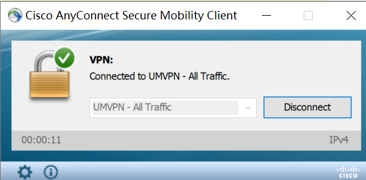
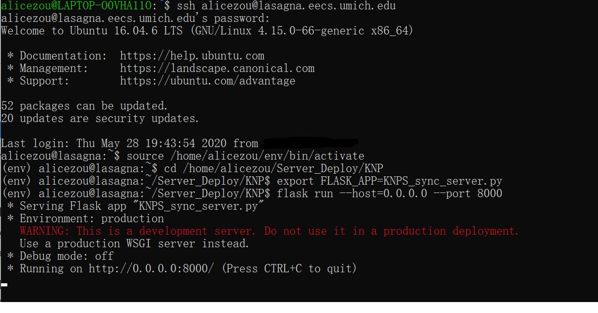
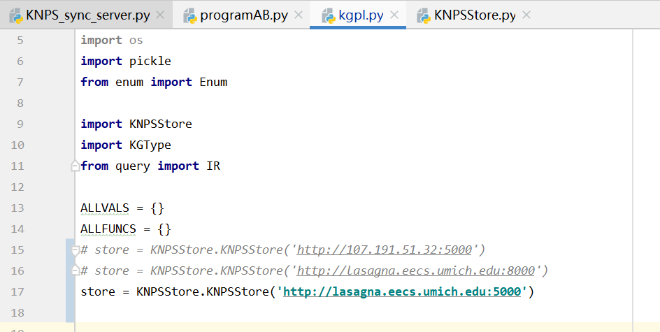

# KNP Server
_created by Jiayun Zou on 5.28.2020_ 

_version 0.0_

_last update: 5.28.2020_

## Access Server
**You need to connect to a UM VPN to access the server.**

**You need to connect to a UM VPN to access the server.**

**You need to connect to a UM VPN to access the server.**

If you do not have a UM VPN, you can download it [here](https://documentation.its.umich.edu/vpn/vpn-download-windows-vpn-client).

Once you have connected to UM VPN, 

you can open a terminal, and type in `ssh <uniquename>@lasagna.eecs.umich.edu`. 
The password is just your password for other UM services.
Now you have accessed the server.
Your current working directory is `/home/<uniquename>`.

## Deploy Project
### How to use server
1. Access the server
1. Activate python virtual environment, you can use `source /home/alicezou/env/bin/activate`.
1. `cd /home/alicezou/Server_Deploy/KNP` 
1. `export FLASK_APP=KNPS_sync_server.py` 
1. `flask run --host=0.0.0.0 --port 8000` (Or whatever port you want)
1. Make sure in kgpl.py (You should adjust the kgpl.py where you run programAB.py or other test programs.
If you run it locally, you should adjust it locally.), you have 
`store = KNPSStore.KNPSStore('http://lasagna.eecs.umich.edu:8000')` 
(If you do not use port 8000, you should change it accordingly.)

You can open many servers at the same time on different ports. 

_For instance, you can test parent server functionality by taking advantage of 
different ports._

### How to update sync server
- Use sftp. (See below)
- Use git.
- Slack me.

You should change your working directory accordingly and change 
`export FLASK_APP=KNPS_sync_server.py` in the previous section into
`export FLASK_APP=<new_server>.py`. 

And please update this document accordingly.

## Appendix
### Python Virtual Environment
You should be able to create a python virtual environment with
`python3 -m venv env`.
If you have created your own virtual environment, you can use requirements.txt to help 
avoid the chores of installation. 
`/home/alicezou/requirements.txt` contains the required packages
to run kgpl smoothly. Use `pip install -r requirements.txt` to install them automatically.

But I encountered some weird issues when I tried to create the virtual environment. 
If you also cannot create a virtual environment smoothly, please feel free to use mine.
Currently, I have created a virtual environment in my folder
and I have installed all required package. You can access my folder with
`cd /home/alicezou`. Then, you can use `source env/bin/activate`
to activate the virtual environment. You can use `deactivate` to exit the 
virtual environment.

### Transmit Files between Server and PC with SFTP
You can transmit files between our server and you pc with the following steps:
1. Open a terminal.
2. Enter the folder on your PC where you want to transmit files with the server.
3. `sftp <uniquename>@lasagna.eecs.umich.edu`. The password is just your password for other UM services
4. Enter the folder on the server where you want to transmit file with.
5. Use `put <filename>` to upload a local file to the server.
Use `get <filename>` to download a file on the server to your PC.

